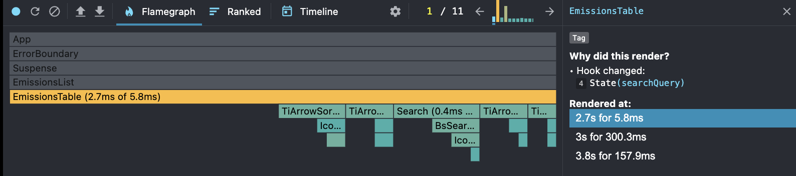
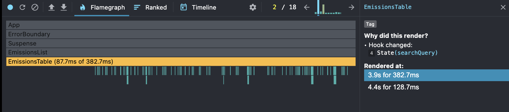
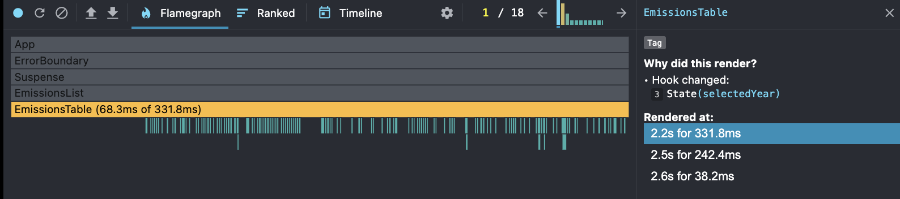
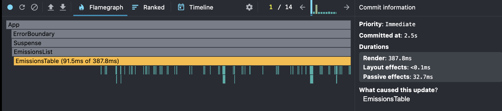
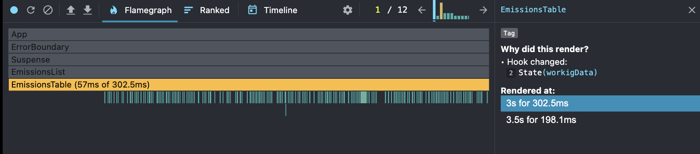
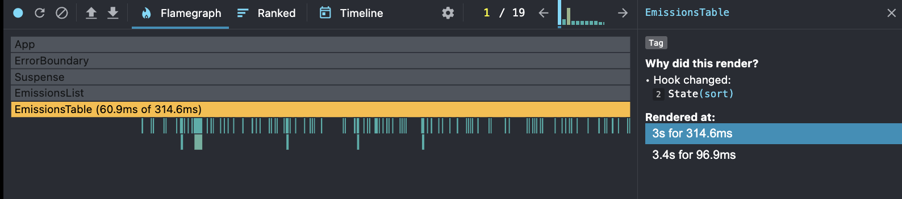
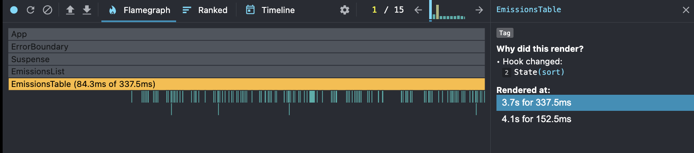
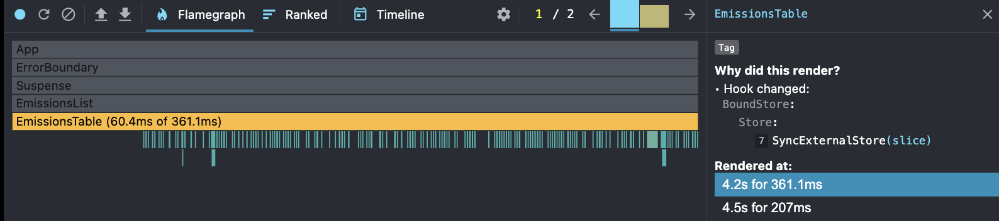
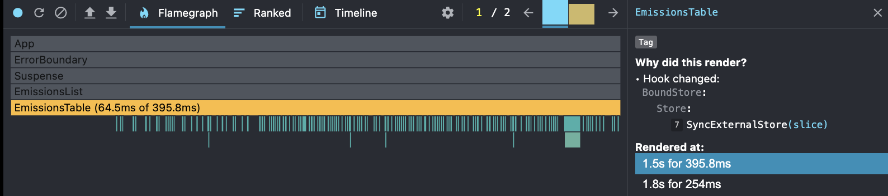

Eco Stats app

- Task: [RS-school - React Performance](https://github.com/rolling-scopes-school/tasks/blob/master/react/modules/tasks/performance.md)

- Code: [GitHub](https://github.com/dzichonka/eco-stats)

- Deploy: [Netlify](https://admirable-kitten-e0b777.netlify.app/)

# Eco Emissions Table - Performance Profiling

This part summarizes the performance of the Emissions Table component using React DevTools Profiler. Measurements were taken before and after optimizations.

Profiling Actions:

## 1. Searching Countries

Scenario: Typing a string not present in the table (no matches) and clearing the search input (all rows displayed).

Before Optimization:

All table rows re-rendered unnecessarily.

After Optimization:

Only filtered rows render.

## 2. Changing Year

Scenario: Selecting a different year from the year selector.

Before Optimization:

Entire table re-rendered; highlight effect applied to all rows.

After Optimization:

Only cells with changed data highlight.

## 3. Sorting

Scenario: Sorting by population and by country name.

Before Optimization:

Sorting triggered full table re-render.

After Optimization:

Only necessary row updates applied.

## 4. Adding/Removing Columns

Scenario: Toggling additional columns (e.g., GDP, Methane, Oil CO₂).

Before Optimization:

Re-render affected all rows unnecessarily.

After Optimization:

Only the new columns render; other cells remain untouched.

